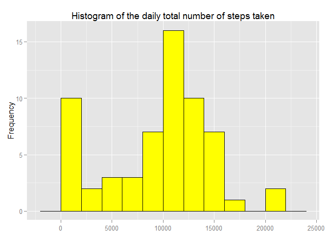
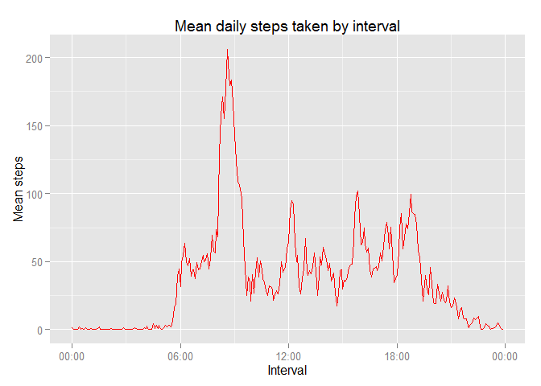
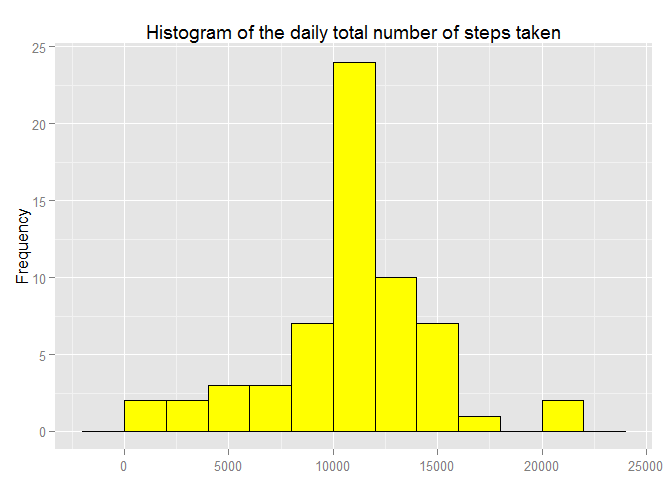
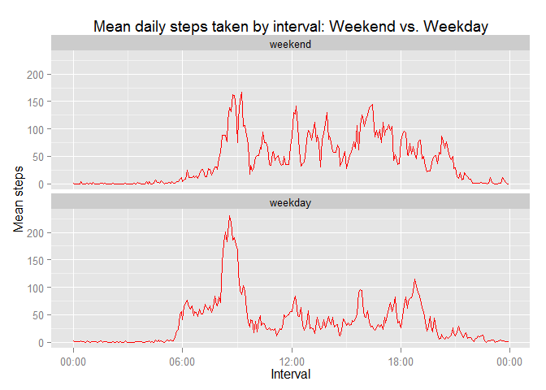

# Reproducible Research: Peer Assessment 1


This document describes the analysis performed for Peer Assignment 1 in the Reproducible Research course from the Johns Hopkins Data Science Coursera specialization.

## Loading and preprocessing the data
Download and unzip the source activity data. 

```r
download.file("https://d396qusza40orc.cloudfront.net/repdata%2Fdata%2Factivity.zip",destfile="activity.zip")
unzip("activity.zip")
```

The unzipped file is a .csv file. Load this data into R.

```r
df.activity <- read.csv("activity.csv")
```

The interval labels in the dataset represent 24-hour clock times but are written as integers. The below step converts the integer representation to a standard 24-hour clock representation.

```r
df.activity$interval <- as.factor(
  sprintf("%02d:%02d",as.numeric(df.activity$interval)%/%100,as.numeric(df.activity$interval)%%100))
```

## What is mean total number of steps taken per day?
Compute the total number of steps taken for each day in the dataset. NA values are treated as zeroes in the sum by setting na.rm = TRUE.

```r
daily.steps <- tapply(df.activity$steps,df.activity$date,sum,na.rm=TRUE)
```

The below histogram describes the distribution of total daily steps across all days in the data set.

```r
library(ggplot2)
ggplot(data.frame(steps = daily.steps)) + 
  geom_histogram(aes(steps),binwidth = 2000,col="black",fill = "yellow") +
  xlab(NULL) + ylab("Frequency") + 
  ggtitle("Histogram of the daily total number of steps taken")
```

 

Compute the mean and median number of steps per day.

```r
mean.daily.steps <- mean(daily.steps)
median.daily.steps <- median(daily.steps)
```
The mean number of steps per day is 9354.23, and the median number of steps per day is 10395.

## What is the average daily activity pattern?
Compute the mean number of steps taken across days for each 5-minute interval. NA values are treated as zeroes in the mean by setting na.rm = TRUE.

```r
mean.interval.steps <- tapply(df.activity$steps,df.activity$interval,mean,na.rm=TRUE)
```

Plot the mean steps by interval.

```r
library(scales)
df.plot <- data.frame(interval = as.POSIXct(names(mean.interval.steps),format = "%H:%M"), 
                      steps = mean.interval.steps)
ggplot(df.plot, aes(interval,steps)) + geom_line(color="red") +
  xlab("Interval") + ylab("Mean steps") +
  scale_x_datetime(labels = date_format("%H:%M")) +
  ggtitle("Mean daily steps taken by interval")
```

 

Find the interval with the maximum number of average steps per day.

```r
index <- which(mean.interval.steps==max(mean.interval.steps))
max.interval <- names(mean.interval.steps)[index]
max.interval.steps <- mean.interval.steps[index]
```
The maximum number of steps per interval is 206.17 in the 08:35 interval.

## Imputing missing values
The total number of NAs in the dataset is:

```r
sum(is.na(df.activity$steps))
```

```
## [1] 2304
```

To impute the missing values, we will use the mean number of steps for the corresponding interval as computed in the previous section, rounded to an integer number of steps. 

```r
df.activity.imputed <- df.activity
df.activity.imputed$steps[is.na(df.activity$steps)] <- 
  round(mean.interval.steps[as.character(df.activity.imputed$interval[is.na(df.activity$steps)])])
```

Using the dataset with the imputed values in place of the NAs, we repeat the analysis of total steps by day.

```r
daily.steps.imputed <- tapply(df.activity.imputed$steps,df.activity.imputed$date,sum,na.rm=TRUE)
ggplot(data.frame(steps = daily.steps.imputed)) + 
  geom_histogram(aes(steps),binwidth = 2000,col="black",fill = "yellow") +
  xlab(NULL) + ylab("Frequency") + 
  ggtitle("Histogram of the daily total number of steps taken")
```

 

The distribution in the histogram no longer has a spike in the smallest bucket and is more evenly centered around the 10,000-12,000 bucket.

```r
mean.daily.steps.imputed <- mean(daily.steps.imputed)
median.daily.steps.imputed <- median(daily.steps.imputed)
```
With imputed values included, the mean number of steps per day is now 10765.64, and the median number of steps per day is now 10762. Both values are larger than when NA values are ignored since the imputation can only increase the total number of steps in a given day.

## Are there differences in activity patterns between weekdays and weekends?
Create a new factor column in the imputed activity data frame indicating whether the data point is from a weekday or weekend day.

```r
df.activity.imputed$daytype = factor("weekday",levels=c("weekend","weekday"))
weekend.ind = weekdays(as.POSIXct(df.activity.imputed$date)) %in% c("Saturday","Sunday")
df.activity.imputed$daytype[weekend.ind] = "weekend"
```
Compute the mean number of daily steps per interval (including the imputed values for NAs) for weekdays and weekend days separately. Reshape using melt so that daytype (weekend/weekday) is a column.

```r
library(reshape2)
mean.interval.steps.daytype <- tapply(df.activity.imputed$steps,
                                      list(df.activity.imputed$interval,df.activity.imputed$daytype),mean,na.rm=TRUE)
mean.interval.steps.daytype <- melt(mean.interval.steps.daytype)
colnames(mean.interval.steps.daytype) <- c("interval","daytype","steps")
```

Compare the weekday and weekend average daily steps per interval using a panel plot. 

```r
mean.interval.steps.daytype$interval <- as.POSIXct(mean.interval.steps.daytype$interval,format = "%H:%M")
ggplot(mean.interval.steps.daytype, aes(interval,steps)) + 
  geom_line(color="red") + facet_wrap(~daytype,ncol=1) +
  xlab("Interval") + ylab("Mean steps") +
  scale_x_datetime(labels = date_format("%H:%M")) +
  ggtitle("Mean daily steps taken by interval: Weekend vs. Weekday")
```

 

The activity on the weekend begins and ends later than on weekdays. The spike in activity in the first part of the day is more pronounced during the week, and the overall activity during the middle of the day appears to be greater during the weekend.
